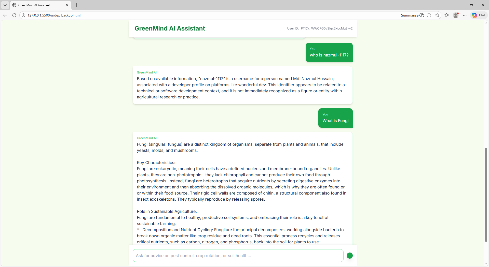

# GreenMind AI Assistant 🌱

[](https://github.com/nazmul-1117/greenmind-ai)
[](LICENSE)
[](https://firebase.google.com/)
[](https://tailwindcss.com/)
[](https://developer.mozilla.org/en-US/docs/Web/JavaScript)
[](https://phosphoricons.com/)
[](https://developers.generativeai.google/)


GreenMind is an AI-powered gardening assistant designed to provide sustainable, factual, and practical advice for gardeners, farmers, and plant enthusiasts. This demo project showcases the front-end chat interface with **API integration** for answering gardening-related queries. The full RAG (Retrieval-Augmented Generation) implementation is planned for the future.

---

## Demo



* Users can type questions about soil health, pest control, crop rotation, and general gardening practices.
* The AI responds with professional, grounded advice (simulated via Gemini API for now).
* Responses can include external sources for additional reference.

---

## Features

* Responsive chat interface built with **Tailwind CSS**.
* Anonymous Firebase authentication for user session handling.
* Firestore integration to store and retrieve chat history.
* Gemini API integration simulating RAG-based AI responses.
* Loading indicators and smooth auto-scroll for improved UX.
* Support for external source citations in AI responses.

---

## Tech Stack

* **Frontend:** HTML, JavaScript, Tailwind CSS
* **Authentication & Database:** Firebase Auth & Firestore
* **AI API:** Gemini API (Google Generative AI)
* **Icons:** Phosphor Icons
* **Font:** Inter

---

## Setup Instructions

1. **Clone the repository**

```bash
git clone https://github.com/<your-username>/greenmind-ai.git
cd greenmind-ai
```

2. **Add API keys**

Create a `secrets.json` file in the project root:

```json
{
  "gemini": {
    "apiKey": "YOUR_GEMINI_API_KEY"
  },
  "firebase": {
    "apiKey": "YOUR_FIREBASE_API_KEY",
    "authDomain": "YOUR_AUTH_DOMAIN",
    "projectId": "YOUR_PROJECT_ID",
    "storageBucket": "YOUR_STORAGE_BUCKET",
    "messagingSenderId": "YOUR_MESSAGING_SENDER_ID",
    "appId": "YOUR_APP_ID",
    "measurementId": "YOUR_MEASUREMENT_ID"
  }
}
```

> **Note:** This demo uses **anonymous authentication** for Firebase. For production, implement proper user authentication.

3. **Open `index.html` in a browser**

> The chat interface should now work, calling the Gemini API and storing messages in Firestore.

---

## Usage

1. Type a gardening question in the input box.
2. Click the **send button** or press Enter.
3. The AI response will appear in the chat window.
4. If external sources are available, they are displayed below the AI message.

---

## Current Status

* ✅ Demo chat interface implemented
* ✅ Firebase integration for storing messages
* ✅ Gemini API integration for AI responses
* ⚠️ **RAG (Retrieval-Augmented Generation) not yet implemented** – currently only calls the API

---

## Future Plans

* Implement full RAG system for **contextual retrieval of gardening knowledge**
* Add **user accounts** and personalized recommendations
* Support **image uploads** for plant diagnosis
* Expand grounding sources to include **scientific publications and trusted gardening databases**
* Improve UI/UX with **dark mode and mobile optimization**

---

## Contributing

Contributions are welcome! Please follow these steps:

1. Fork the repository
2. Create a new branch (`git checkout -b feature-name`)
3. Make your changes
4. Submit a pull request

---

## License

This project is licensed under the **MIT License**.

---

**GreenMind AI** – Encouraging sustainable gardening, one plant at a time 🌱

---
